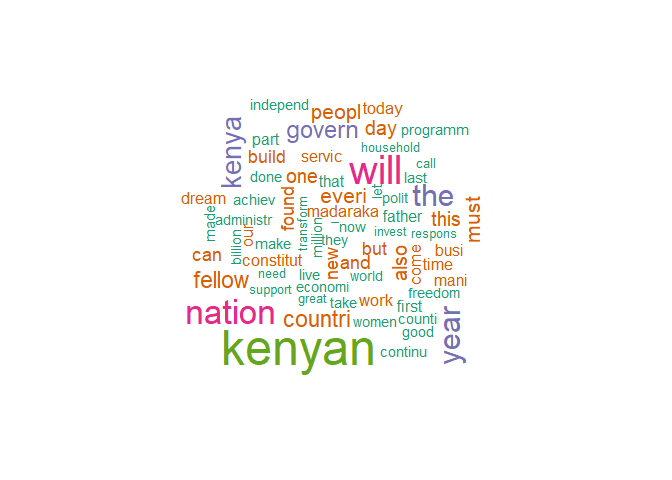
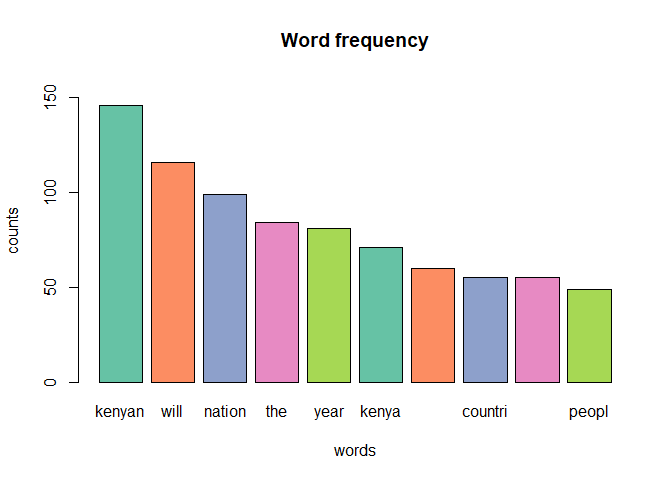
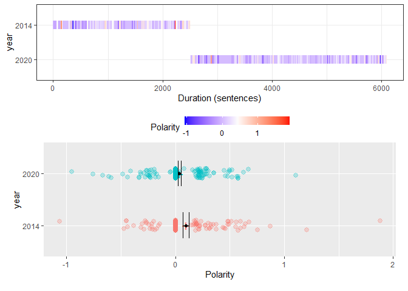
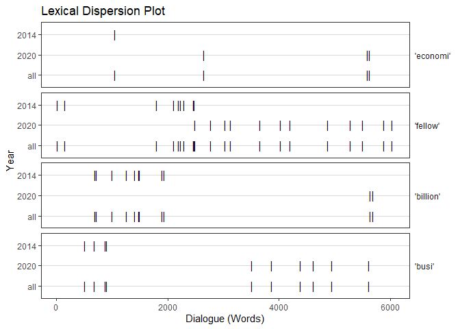

NATURAL LANGUAGE PROCESSING
================
kipngenokoech
7/11/2021

## INTRODUCTION

Natural language processing (NLP) is the ability of a computer program to understand human language as it is spoken and written.Madaraka day is the day Kenya achieved independent internal self-governance from the British colonists.We are going to analyse President Uhuru Kenyatta speeches from 2014-2020. 


``` r
#loading libraries and files
library(tm)
library(SnowballC)
library(wordcloud)
library(RColorBrewer)
library(pdftools)
library(topicmodels)
library(qdap)

text_2014 <- pdf_text("2014.pdf")#reading files into our environment
text_2016 <- pdf_text("2016.pdf")
text_2018 <- pdf_text("2018.pdf")
text_2019 <- pdf_text("2019.pdf")
text_2020 <- pdf_text("2020.pdf")

#Exporting our dataframe into a file
write.table(text_2014,"C:/Users/USER/Desktop/pandas/Natural-Language-P-rocessing/enockact/text_2014.text")
write.table(text_2016,"C:/Users/USER/Desktop/pandas/Natural-Language-P-rocessing/enockact/text_2016.text")
write.table(text_2018,"C:/Users/USER/Desktop/pandas/Natural-Language-P-rocessing/enockact/text_2018.text")
write.table(text_2019,"C:/Users/USER/Desktop/pandas/Natural-Language-P-rocessing/enockact/text_2019.text")
write.table(text_2020,"C:/Users/USER/Desktop/pandas/Natural-Language-P-rocessing/enockact/text_2020.text")
```

Creating corpus from our files. Corpus is a collection of text documents
which can are machine readable.

``` r
#creating a corpus
name<-file.path("C:/Users/USER/Desktop/pandas/Natural-Language-P-rocessing/enockact")
length(dir(name))
```

    ## [1] 5

``` r
dir(name)
```

    ## [1] "text_2014.text" "text_2016.text" "text_2018.text" "text_2019.text"
    ## [5] "text_2020.text"

``` r
docs<-Corpus(DirSource(name))
docs
```

    ## <<SimpleCorpus>>
    ## Metadata:  corpus specific: 1, document level (indexed): 0
    ## Content:  documents: 5

``` r
#text transformation
ocs<-tm_map(docs,tolower)# tranforms text to lower case
docs<-tm_map(docs,removeNumbers)#remove numbers within our corpus
docs<-tm_map(docs,removePunctuation)# remove all forms of punctuations
docs<-tm_map(docs,removeWords,stopwords("english")) #remove commons words like is,in and where
docs<-tm_map(docs,stripWhitespace)#remove the spaces left after eliminating punctuations 
docs<-tm_map(docs,stemDocument)
```

``` r
#creating sparse matrix
dtm<-DocumentTermMatrix(docs)
dim(dtm)
```

    ## [1]    5 2361

``` r
#specify sparsity matrix
dtm<-removeSparseTerms(dtm,0.51)
```

``` r
#naming rows
rownames(dtm)<-c("2014","2016" ,"2018","2019","2020")

inspect(dtm[1:5,1:6])
```

    ## <<DocumentTermMatrix (documents: 5, terms: 6)>>
    ## Non-/sparse entries: 25/5
    ## Sparsity           : 17%
    ## Maximal term length: 9
    ## Weighting          : term frequency (tf)
    ## Sample             :
    ##       Terms
    ## Docs   access achiev across act action administr
    ##   2014      2      5      3   1      1         1
    ##   2016      1      6      2   0      0         3
    ##   2018      2      5      2   0      0         2
    ##   2019      8      3      4   1      2         7
    ##   2020      0      6      1   4      1         9

## MODELING AND EVALUATION
``` r
freq<-colSums(as.matrix(dtm))
#examing the head and the tail
ord<-order(-freq)
freq[head(ord)]
```

    ## kenyan   will nation    the   year  kenya 
    ##    146    116     99     84     81     71

``` r
freq[tail(ord)]
```

    ##  extens   moral  parent student     wit  worker 
    ##       3       3       3       3       3       3

President Kenyatta frequently used the word `kenya`.`worker`,`wit`,`student`,`parent` being the least words used.

``` r
#identifying association of words using correlation
findAssocs(dtm,"economi",corlimit = 0.9)
```

    ## $economi
    ##        better        fellow infrastructur         creat           one 
    ##          1.00          1.00          1.00          0.99          0.99 
    ##       digniti          time     transform        action          also 
    ##          0.98          0.98          0.98          0.97          0.97 
    ##          busi          care       environ          fund         initi 
    ##          0.97          0.97          0.97          0.97          0.97 
    ##        person      programm        improv         local        market 
    ##          0.97          0.97          0.96          0.96          0.96 
    ##       project     technolog         major         pride           the 
    ##          0.96          0.96          0.95          0.95          0.95 
    ##         whose     enterpris          home          made        social 
    ##          0.95          0.94          0.94          0.94          0.94 
    ##        within         among       develop        sector          take 
    ##          0.94          0.93          0.93          0.93          0.93 
    ##           tax          alon        direct          full           job 
    ##          0.93          0.92          0.92          0.92          0.92 
    ##        kenyan      progress           see         shall       special 
    ##          0.92          0.92          0.92          0.92          0.92 
    ##          life        realiz       continu        demand        friend 
    ##          0.92          0.92          0.91          0.91          0.91 
    ##         money         avail        produc 
    ##          0.91          0.90          0.90


`Better`,`fellow`,`infrastructure` have a correlation of `1` with the
word `economi` ass shown above.

### VISUAL PORTRAYAL

### Word cloud
Word cloud is used to visualize the word frequencies.The size of each word depends on the frequency of occurrence in our document.
``` r
wordcloud(names(freq),freq,min.freq = 20,scale = c(3,.5),colors = brewer.pal(5,"Dark2"))
```

<!-- --> 

`Kenyan` has the highest frequency compared to the rest of the words.


### barplot
``` r
freq<-sort(colSums(as.matrix(dtm)),decreasing = TRUE)
word_freq<-data.frame(word=names(freq),freq=freq)
word_freq<-word_freq[1:10,]
coul <- brewer.pal(5, "Set2") 
barplot(word_freq$freq,names=word_freq$word,col=coul,main = "Word frequency",xlab = "words",ylab = "counts",ylim = c(0,160))
```

<!-- --> 

The bar graph above clearly shows the frequency of each word ,`kenyan` having the highest frequency compared to the rest.

``` r
#comapring 2014 and 2020 speeches
speech14<-data.frame(speech=text_2014)
sent14<-sentSplit(speech14,"speech")
sent14$year<-"2014"
speech20<-data.frame(speech=text_2020)
sent20<-sentSplit(speech20,"speech")
sent20$year<-"2020"
#concatenate the datasets
sentences<-rbind(sent14,sent20)
```

``` r
#comparing polarity
pol<-polarity(sentences$speech,sentences$year)
pol
```

    ##   year total.sentences total.words ave.polarity sd.polarity stan.mean.polarity
    ## 1 2014             142        2513        0.097       0.323              0.301
    ## 2 2020             329        3668        0.039       0.232              0.166
    

The year 2020 the speech was longer compared to previous years with `329` sentences and `3668` words.

``` r
plot(pol)
```

<!-- --> 

On the year 2014 the speech had strong negative sentiments with standard polarity of `0.323`compared
to 2020 with `0.232` standard mean polarity as shown by the polarity plot.

``` r
#Dispersion plot of the following selected words(economi,fellow,billion,busi)

dispersion_plot(sentences$speech,grouping.var=sentences$year,c("economi","fellow","billion","busi"),color="black",bg.color="white")
```

<!-- -->

This is quite interesting as these topics were discussed early on in the 2014 speech
but at the end in the 2020 speech.
